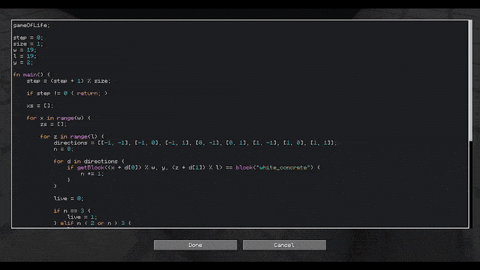

# Blogic

Minecraft mod that adds a survival-friendly programming language that can interact with the world.



## Todo

- del keyword to remove variables (only from current scope?)
- list copy function
- struct access by ["id"]
- struct destructuring?
- struct get function? (key: get { return this.a + 1; })
- struct variable name shorthand (id instead of id: id)
- type checking (is keyword)
- rewrite expression parsing
- tab, shift-tab, auto-indent, auto open and close
- tab autocomplete
- better error context (source location, etc)
- unify some of the logic between custom and builtin functions (parsing and arguments)
- add block for import?, access modifiers
- address while loop max iterations issue
- separate language from the game, allowing it to run on its own
- static types?
- enums?
- list comprehension?
- in-language errors, exceptions?
- codec for entire program?
- balancing: breaking blocks requires tool, and takes time

## Ideas

- portable controller that executes from player
- wait/sleep function to control tick time (prob requires multithreading)
- reader, importer, and exporter blocks instead of available everywhere?
- time/amount/too easy balancing
- maybe action functions (read, import, export) each take 1 tick to execute
- read entities like commands (@n, etc)
- storage and auto-crafting features like ae2
- storage blocks like drawers, trash, etc
- chunk loaders
- mob farm features like apothic spawners and mob grind utils
- redstone blocks like switches and indicators
- display blocks for text, items, pixels?, etc
- inventory management features like sophisticated backpacks
- building features like building gadgets
- wireless imports/exports
- fluids and energy
- xp pickup
- ways to control logic with keybinds (create gamepad thingy)

## Farms

- stone/cobblestone
- moss/azalea
- dirt/oak
- all trees
- sugar cane
- bamboo
- dripstone
- lava
- piglin barter
- smart furnace array
- basic item flow control
- overflow
- advanced filtering with nbt, tags, etc

## Read

- redstone
- inventory
- block
- fluid
- world
- network

## Import

- inventory
- block
- fluid
- item
- energy

## Export

- redstone
- inventory
- block
- fluid
- item
- energy
- interaction

## Examples

```rust
gameOfLife;

step = 0;
size = 1;
w = 19;
l = 19;
y = 2;

fn main() {
    step = (step + 1) % size;

    if step != 0 { return; }

    xs = [];

    for x in range(w) {
        zs = [];

        for z in range(l) {
            directions = [[-1, -1], [-1, 0], [-1, 1], [0, -1], [0, 1], [1, -1], [1, 0], [1, 1]];
            n = 0;

            for d in directions {
                if getBlock((x + d[0]) % w, y, (z + d[1]) % l) == block("white_concrete") {
                    n += 1;
                }
            }

            live = 0;

            if n == 3 {
                live = 1;
            } elif n < 2 or n > 3 {
                live = -1;
            }

            zs.append(live);
        }

        xs.append(zs);
    }

    for x in range(w) {
        for z in range(l) {
            live = xs[x][z];

            if live == 1 {
                breakBlock(x, y, z, fn block: true);
                placeBlock(x, y, z, fn item: item == item("white_concrete"));
            } elif live == -1 {
                breakBlock(x, y, z, fn block: true);
                placeBlock(x, y, z, fn item: item == item("black_concrete"));
            }
        }
    }
}

dirtAndOakFarm;

neededItems = [item("moss_block"), item("azalea"), item("bone_meal"), item("iron_shovel")];
exportItems = [item("oak_log"), item("dirt")];

fn main() {
    if !getItems().containsAll(neededItems) { return; }

    placeBlock(-1, 0, 0, fn item: item == item("moss_block"));
    placeBlock(-1, 1, 0, fn item: item == item("azalea"));

    while getBlock(-1, 1, 0) == block("azalea") and getItems().contains(item("bone_meal")) {
        useItem(-1, 1, 0, fn item: item == item("bone_meal"));
    }

    for y in range(1, 8) {
        breakBlock(-1, y, 0, fn block: block == block("oak_log"));
    }

    if getBlock(-1, 1, 0) == block("azalea") { return; }

    useItem(-1, 0, 0, fn item: item == item("iron_shovel"));
    breakBlock(-1, 0, 0, fn block: true);
    exportAllItems(-2, 0, 0, fn item: exportItems.contains(item));
}

treeFarm;

neededItems = [item("oak_sapling"), item("bone_meal")];
keepItems = [item("oak_sapling"), item("bone_meal"), item("oak_log")];

fn main() {
    if !getItems().containsAll(neededItems) { return; }

    placeBlock(0, 2, 0, fn item: item == item("oak_sapling"));

    while getBlock(0, 2, 0) == block("oak_sapling") and getItems().contains(item("bone_meal")) {
        useItem(0, 2, 0, fn item: item == item("bone_meal"));
    }

    for x in range(-2, 3) { for z in range(-2, 3) { for y in range(2, 8) {
        breakBlock(x, y, z, fn block: true);
    }}}

    deleteItems(fn item: !keepItems.contains(item));
}

boneMealFarm;

neededItems = [item("stone"), item("bone_meal")];
y = -3;

fn main() {
    useItem(0, 4, 0, fn item: !neededItems.contains(item));

    if !getItems().containsAll(neededItems) { return; }

    for x in range(-3, 4) {
        for z in range(-3, 4) {
            placeBlock(x, y, z, fn item: item == item("stone"));
        }
    }

    useItem(0, y, 0, fn item: item == item("bone_meal"));

    for x in range(-3, 4) {
        for z in range(-3, 4) {
            breakBlock(x, y + 1, z, fn block: true);
            breakBlock(x, y, z, fn block: block == block("moss_block"));
        }
    }

    placeBlock(0, y, 0, fn item: item == item("moss_block"));
}

```

## Credit

Language tokenizing based on [Alexander Makeev's toy language](https://github.com/alexandermakeev/toy-language)
