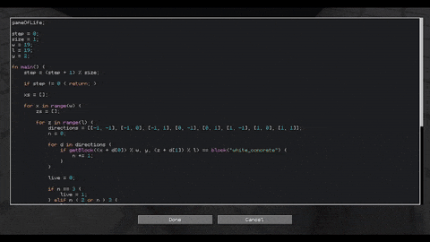

# Blogic

Minecraft mod that adds a survival-friendly programming language that can interact with the world. Uses the [Blang](https://github.com/braydenoneal/blang) programming language.

## Todo

- codec for converting kotlin nullables to java optionals (scope, elseIfStatement, ifStatement)
- allow saving the world mid-execution by encoding the program and its execution state
- separate the parsing and execution logic a bit more
- add empty/null statement for empty statement lists
- controlled order of execution for multiple controllers in a network?
- separate font for the text editor
- ide extension or just mirroring files to allow editing code externally
- fix array access after call: someFunc()[0]
- random function
- add properties to many values to replace some functions (item.tag instead of tag(item), etc)
- rewrite expression parsing
- struct this keyword in functions
- struct access by ["id"]
- struct destructuring?
- struct get function? (key: get { return this.a + 1; })
- struct variable name shorthand (id instead of id: id)
- allow del as an alternative to remove functions
- option to run imports from either context/location
- isChunkLoaded function
- if switch to read, import, export block for functions, then have network priority option to control order
- tab, shift-tab, auto-indent, auto open and close
- tab autocomplete
- better error context (source location, etc)
- unify some of the logic between custom and builtin functions (parsing and arguments)
- add block for import?, access modifiers
- address while loop max iterations issue
- static types?
- enums?
- list comprehension?
- in-language errors, exceptions?
- balancing: breaking blocks requires tool, and takes time

## Ideas

- balancing: ability to upgrade:
    - reach
    - number of actions per tick
    - types of actions it can do
    - number of items it can move per tick
    - speed of the actions
    - upgrades and code are stored in the controller when broken
    - upgrades and code can be taken out of the controller and stored as items
- portable controller that executes from player
- wait/sleep function to control tick time (prob requires multithreading)
- reader, importer, and exporter blocks instead of available everywhere?
- time/amount/too easy balancing
- maybe action functions (read, import, export) each take 1 tick to execute
- read entities like commands (@n, etc)
- storage and auto-crafting features like ae2
- storage blocks like drawers, trash, etc
- chunk loaders
- mob farm features like apothic spawners and mob grind utils
- redstone blocks like switches and indicators
- display blocks for text, items, pixels?, etc
- inventory management features like sophisticated backpacks
- building features like building gadgets
- wireless imports/exports
- fluids and energy
- xp pickup
- ways to control logic with keybinds (create-mod gamepad thingy)

## Farms

- stone/cobblestone
- moss/azalea
- dirt/oak
- all trees
- sugar cane
- bamboo
- dripstone
- lava
- piglin barter
- smart furnace array
- basic item flow control
- overflow
- advanced filtering with nbt, tags, etc
- easy item storage sorting

## Read

- redstone
- inventory
- block
- fluid
- world
- network

## Import

- inventory
- block
- fluid
- item
- energy

## Export

- redstone
- inventory
- block
- fluid
- item
- energy
- interaction
